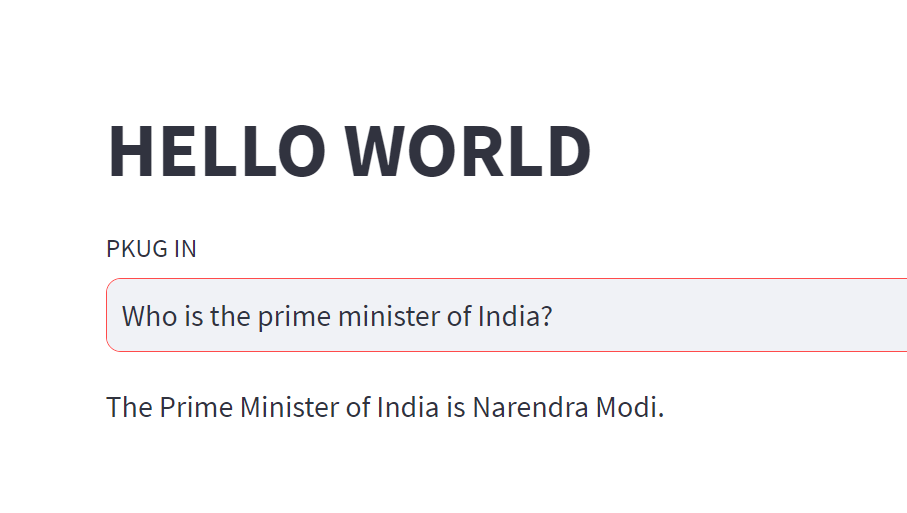
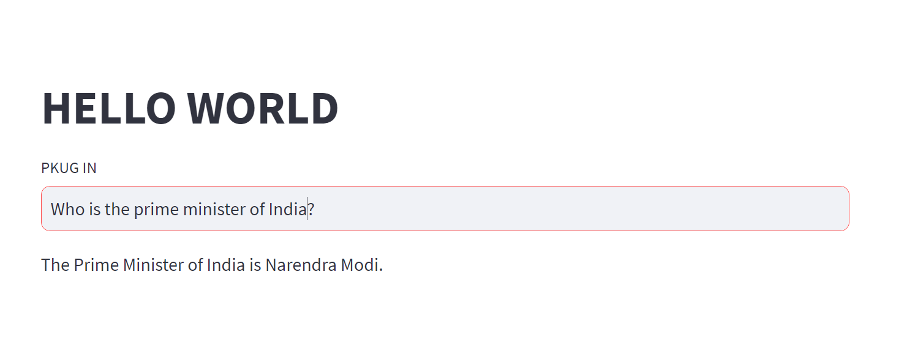
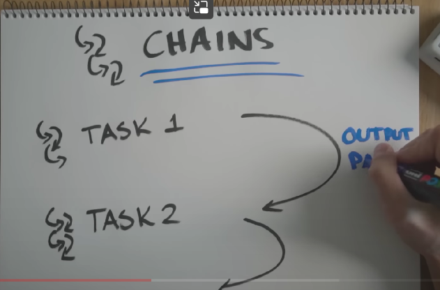
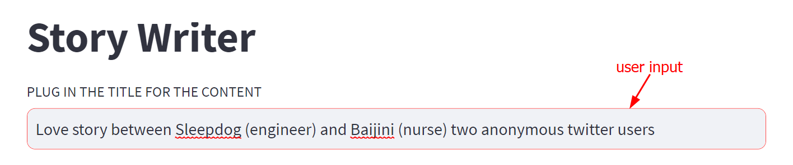
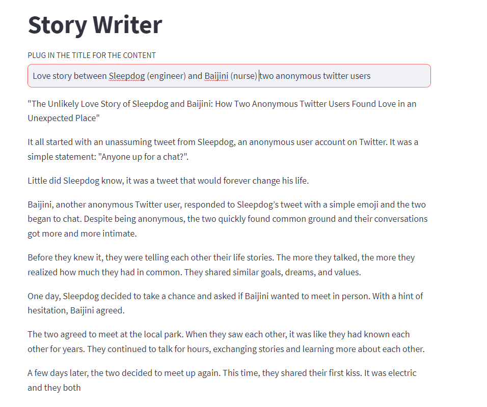

Inspired by: https://www.youtube.com/watch?v=MlK6SIjcjE8&t=1069s
```
# Dependencies
import os
from secret_key import openapi_key

import streamlit as st
from langchain.llms import OpenAI

os.environ['OPENAI_API_KEY'] = openapi_key

#APP Framework
st.title("HELLO WORLD")
prompt = st.text_input("PLUG IN")

#LLMS
llm = OpenAI(temperature= 0.9)

if prompt:
    response = llm(prompt)
    st.write(response)

```
In this code we simply deployed the model with the streamlit with the openai being called on the backend

**Template**
```
# Dependencies
import os
from secret_key import openapi_key

#OPENAI
import streamlit as st
from langchain.llms import OpenAI
from langchain.prompts import PromptTemplate
from langchain.chains import LLMChain

os.environ['OPENAI_API_KEY'] = openapi_key

#APP Framework
st.title("HELLO WORLD")
prompt = st.text_input("PLUG IN")

title_template = PromptTemplate(
    input_variables=['topic'],
    template='write me a sexy video title about {topic}'
)
#LLMS
llm = OpenAI(temperature= 0.9)
title_chain = LLMChain(llm=llm,prompt=title_template,verbose =True)

if prompt:
    response = title_chain.run(prompt)
    st.write(response)
```
Now there is a change in terms of how the input can be passed
**CHAINS**

*Simple Sequential Chain* to encorporate the stacking of the chains
```
# Dependencies
import os
from secret_key import openapi_key

#OPENAI
import streamlit as st
from langchain.llms import OpenAI
from langchain.prompts import PromptTemplate
from langchain.chains import LLMChain,SimpleSequentialChain

os.environ['OPENAI_API_KEY'] = openapi_key

#APP Framework
st.title("Youtube Title Recommender")
prompt = st.text_input("PLUG IN THE TITLE FOR THE CONTENT")

title_template = PromptTemplate(
    input_variables=['topic'],
    template='write me a youtube title about {topic}'
)

script_template = PromptTemplate(
    input_variables=['title'],
    template='write me a youtube script based on the title: {title}'
)
#LLMS
llm = OpenAI(temperature= 0.9)
title_chain = LLMChain(llm=llm,prompt=title_template,verbose =True)
script_chain = LLMChain(llm=llm,prompt=script_template,verbose =True)
sequential_chain = SimpleSequentialChain(chains=[title_chain,script_chain],verbose=True)


if prompt:
    response = sequential_chain.run(prompt)
    st.write(response)
```
The problem with the simple sequential chain is the prompt->title-> script but the title is unlikely to come up

**Final Project**
`streamlit run main.py` runs the project

